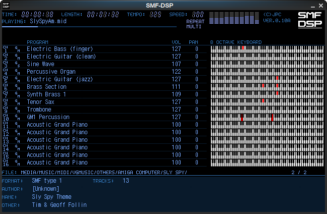

# smf-dsp

Advanced MIDI file player for desktop computer

# Usage

Press F1 for help screen.
Press F12 to access advanced options, which can be edited in configuration files.

The changes made in configuration files are effective after restarting.

Some synthesizers require a ROM or SoundFont to be provided, and specified in the configuration.

# Keys

The keys are recognized by physical location and not label.

The listed key names are based on the QWERTY keyboard type, it will vary for a different type of layout.

| Key        | Function                                                                     |
|------------|------------------------------------------------------------------------------|
| F1         | Open the help screen                                                         |
| F2         | Select a MIDI device for playback                                            |
| F3         | Select a synthesizer device for playback                                     |
| F4         | Configure global audio effects                                               |
| F9         | Select a theme for the user interface                                        |
| F12        | Open the configuration directory                                             |
| Tab        | Switch between file browser and track info                                   |
| Esc        | Quit the program                                                             |
| -          | Decrement the proportional window size                                       |
| =          | Increment the proportional window size                                       |
| Page ↑     | Go to previous track in playlist/folder                                      |
| Page ↓     | Go to next track in playlist/folder                                          |
| Space      | Pause or unpause                                                             |
| Home       | Seek to beginning of current track                                           |
| End        | Seek to end of current track                                                 |
| ←↕→        | Navigate in the file browser                                                 |
| ←→         | In track info view, seek track by ± 5 seconds                                |
| Shift + ←→ | In any view, seek track by ± 10 seconds                                      |
| [          | Decrease speed by 1%                                                         |
| ]          | Increase speed by 1%                                                         |
| `          | Switch between repeat modes: On/Off, and Single/Multi                        |
| /          | Scan songs in the current folder of the file browser and play them at random |

# Building

To build the software, type these commands in the source directory.

- `mkdir build`
- `cd build`
- `cmake -DCMAKE_BUILD_TYPE=Release ..`
- `cmake --build .`

Install following packages on Debian/LibraZiK/Mint:

- `build-essential` `git` `pkg-config` `libsdl2-dev` `libasound2-dev` `libpulse-dev` `libjack-jackd2-dev` `libuv-dev` `libuchardet-dev`

(in case JACK 1 is preferred over JACK 2, replace `libjack-jackd2-dev` with `libjack-dev`)

Immediately after building, the program is available by starting `./smf-dsp`.

## Building synthesizers

The optional synthesizers have additional requirements, and they are built only if these are present.

- **Fluidsynth**: check out the `thirdparty/fluidlite` submodule.
- **FM-OPL3 (ADLMIDI)**: check out the `thirdparty/libADLMIDI` submodule.
- **FM-OPN2 (OPNMIDI)**: check out the `thirdparty/libOPNMIDI` submodule.
- **SCC (emidi)**: check out the `thirdparty/scc` submodule.
- **MT32EMU**: check out the `thirdparty/munt` submodule.
